# The hardest Meowdoku boards, by the rulebook

Difficulty here means *how much the rules of `RULES.md` have to guess*.  A rule-only solver (`rule_solver.py`) runs the direct rules (single candidates, common attack, colours locked in lines, lines made of few colours, full rectangles) to a fixed point.  If that does not finish the board, it tries a what-if on every open cell: place a cat there and run the direct rules; a contradiction crosses the cell out.  A board that needs a what-if has depth 1; one that needs a what-if *inside* a what-if has depth 2.  The meter is the tuple (depth, what-if rounds at that depth, cells crossed out by what-ifs, direct-rule steps), compared left to right.

For each size, `hardest.py` samples random boards with a unique solution and then hill-climbs the best ones by moving boundary cells between colours.  Every board that ties the maximum is listed, after removing the 8 symmetries and colour renamings.  The search is heuristic: these are the hardest boards *found*, not a proof that nothing harder exists.

## Summary

| size | random boards sampled | with a unique solution | of those, needing a what-if | climb steps | max difficulty | boards tying the max |
|---|---|---|---|---|---|---|
| 5 x 5 | 497030 | 323465 | 54 | 244244 | (1, 1, 17, 8) | 28 |
| 6 x 6 | 372751 | 153091 | 73 | 98451 | (1, 1, 28, 8) | 39 |
| 7 x 7 | 252777 | 74301 | 36 | 49872 | (1, 1, 35, 8) | 60 |
| 8 x 8 | 168885 | 37611 | 30 | 20794 | (1, 1, 56, 8) | 123 |
| 9 x 9 | 114872 | 20552 | 9 | 9908 | (1, 1, 67, 11) | 301 |
| 10 x 10 | 72105 | 10680 | 5 | 10470 | (1, 1, 42, 19) | 564 |

Level 155 from the screenshot scores (0, 0, 0, 16): the direct rules alone solve it.

## 5 x 5: difficulty (1, 1, 17, 8), 28 board(s)

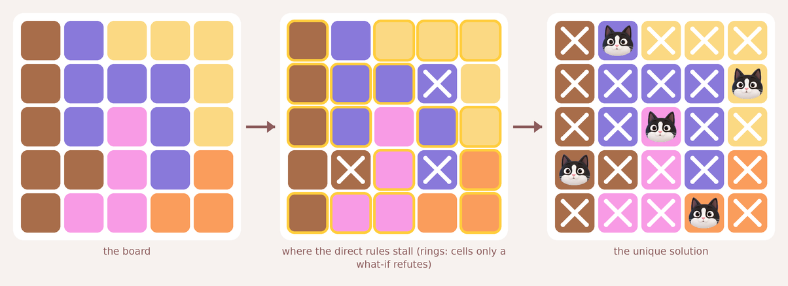

```
30111
30001
30201
33204
32244
```

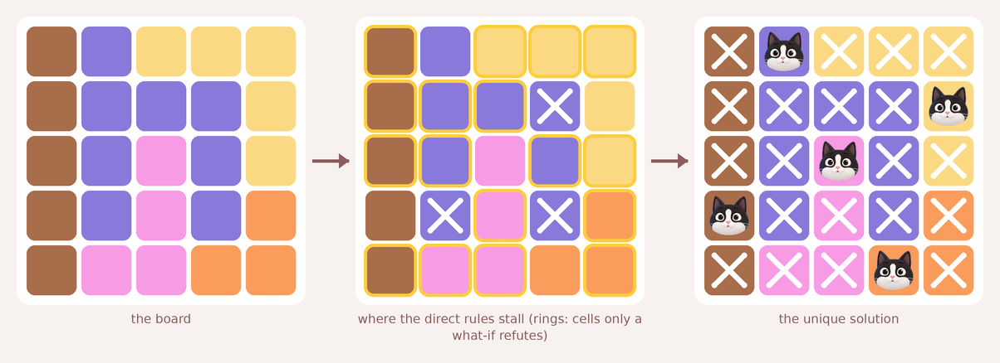

```
30111
30001
30201
30204
32244
```

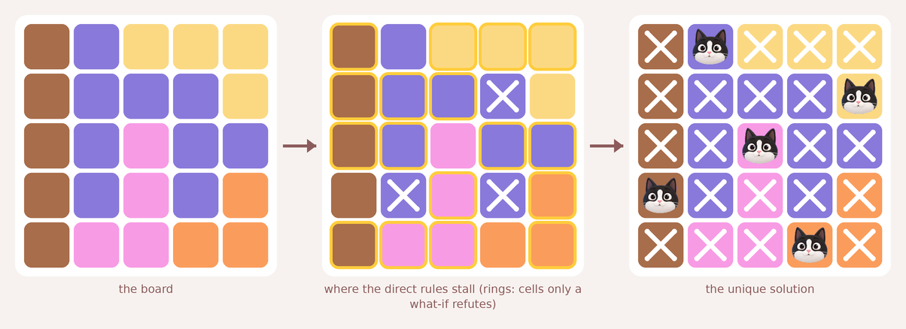

```
30111
30001
30200
30204
32244
```

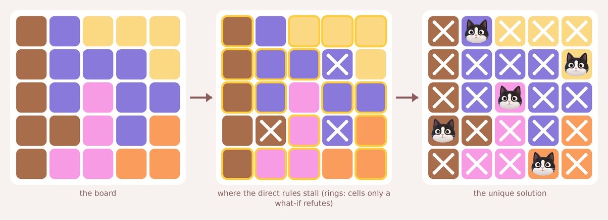

```
30111
30001
30200
33204
32244
```

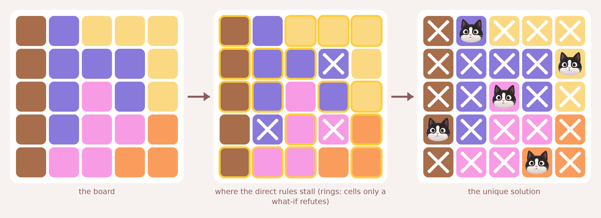

```
30111
30001
30201
30224
32244
```

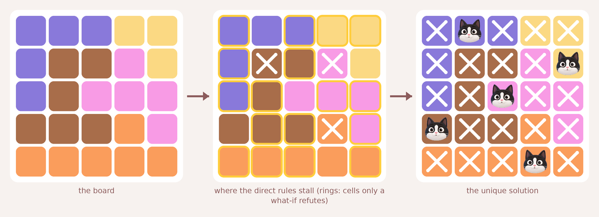

```
00011
03321
03222
33342
44444
```

22 more tying boards are in `hardest.json`.

## 6 x 6: difficulty (1, 1, 28, 8), 39 board(s)

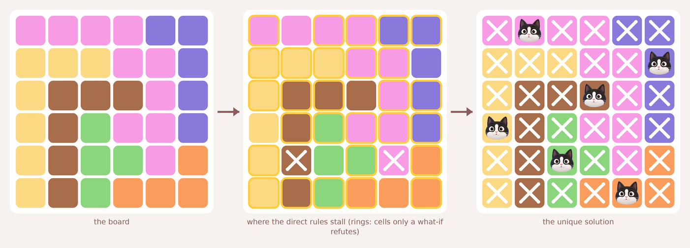

```
222200
111220
133320
135220
135524
135444
```

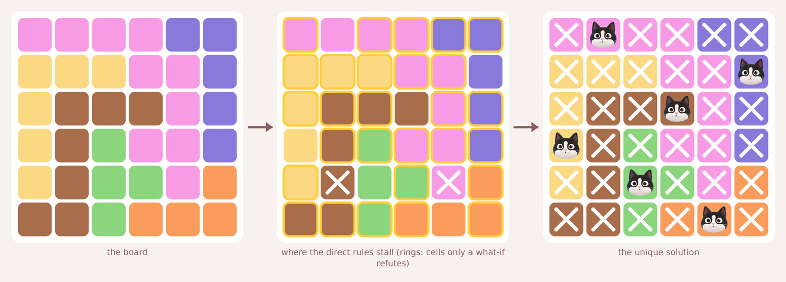

```
222200
111220
133320
135220
135524
335444
```

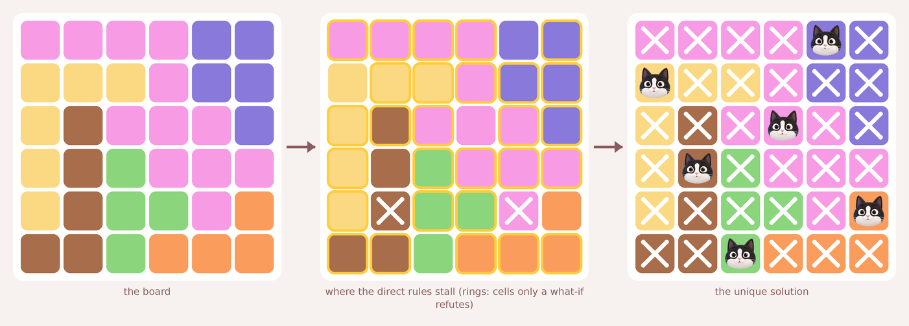

```
222200
111200
132220
135222
135524
335444
```

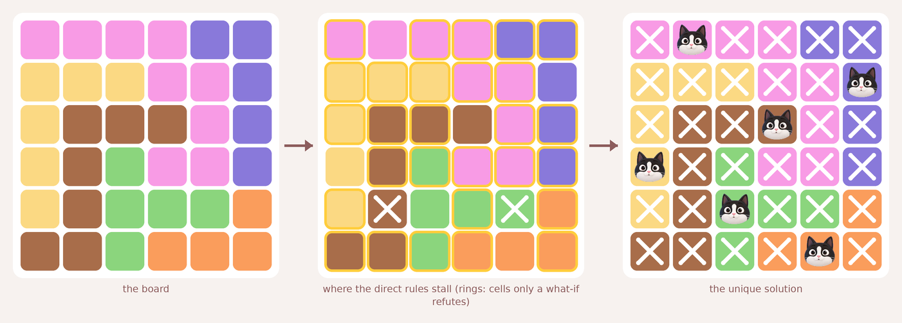

```
222200
111220
133320
135220
135554
335444
```

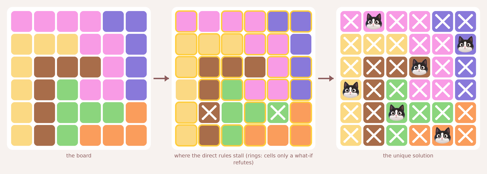

```
222200
111220
133320
135220
135554
135444
```

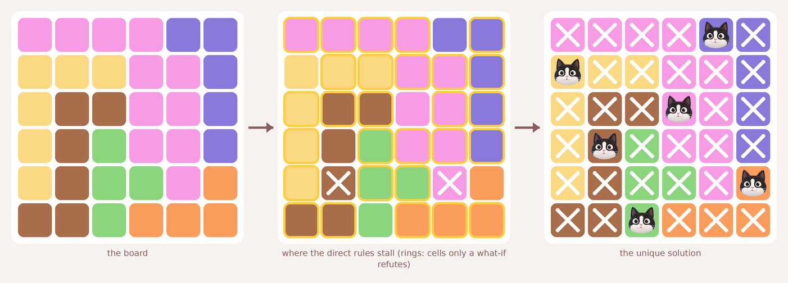

```
222200
111220
133220
135220
135524
335444
```

33 more tying boards are in `hardest.json`.

## 7 x 7: difficulty (1, 1, 35, 8), 60 board(s)


```
0233111
0223313
2233313
2336333
2446666
2444655
2266655
```

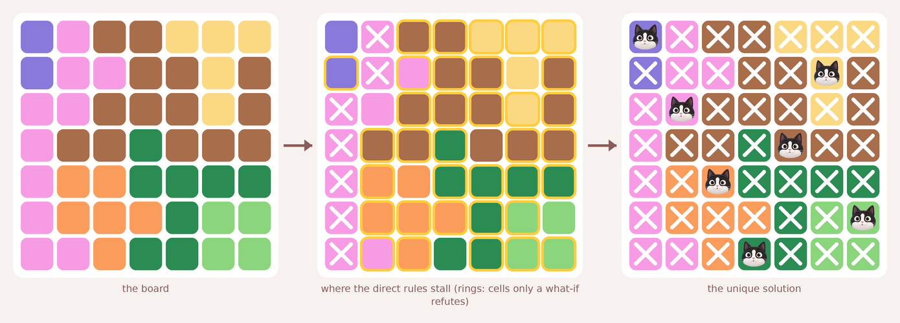

```
0233111
0223313
2233313
2336333
2446666
2444655
2246655
```

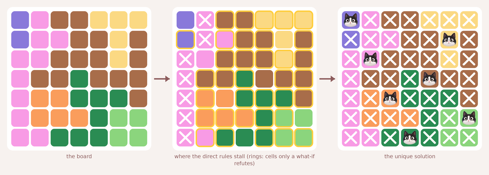

```
0233111
0223313
2233313
2336333
2446663
2444655
2266655
```

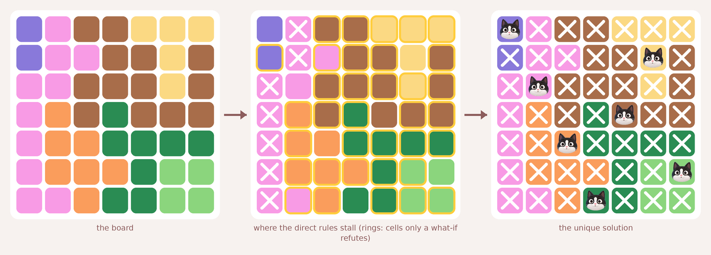

```
0233111
0223313
2233313
2436333
2446666
2444655
2246655
```

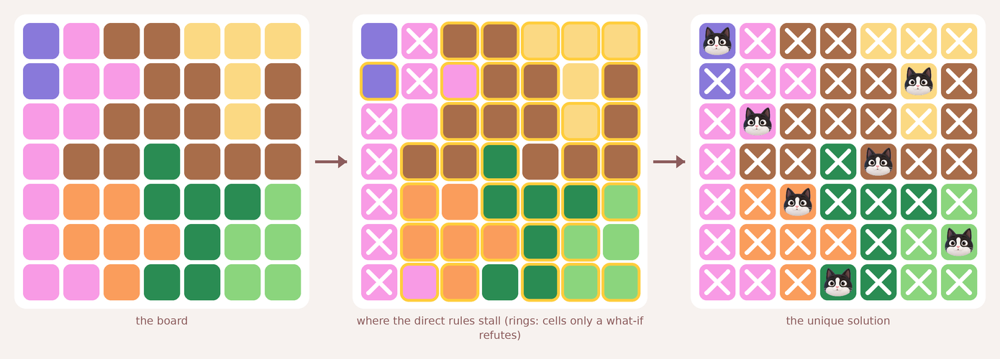

```
0233111
0223313
2233313
2336333
2446665
2444655
2246655
```


```
0233111
0223313
2233313
2466333
2446666
2444655
2246655
```

54 more tying boards are in `hardest.json`.

## 8 x 8: difficulty (1, 1, 56, 8), 123 board(s)


```
10000555
10220555
11225533
12255533
74656555
74666555
74446655
77744445
```


```
10000555
10220555
11220533
14555533
74656555
74666555
74446655
77744445
```

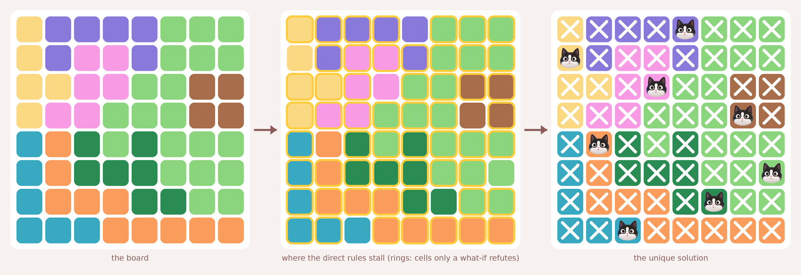

```
10000555
10220555
11225533
12255533
74656555
74666555
74446655
77744444
```

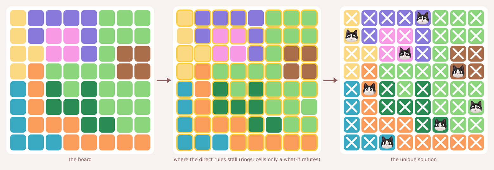

```
10000555
10220555
11220533
14555533
74656555
74666555
74446655
77744444
```

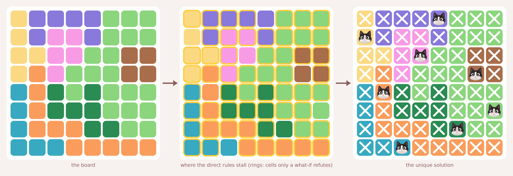

```
10000555
10220555
11225533
14255533
74656555
74666555
74446655
77744444
```

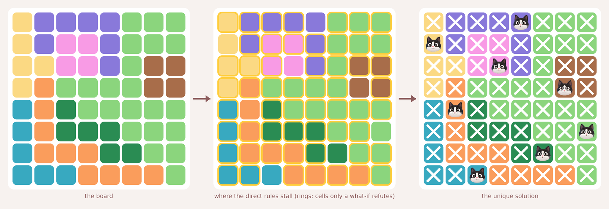

```
10000555
10220555
11220533
14555533
74655555
74666555
74446655
77744445
```

117 more tying boards are in `hardest.json`.

## 9 x 9: difficulty (1, 1, 67, 11), 301 board(s)


```
000004443
001144333
221446333
241466333
744463333
764666635
766666335
767783355
777888335
```

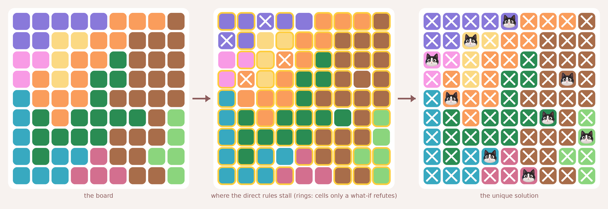

```
000004443
001144333
221446333
241466333
744463333
764666635
766663335
767783355
777888335
```

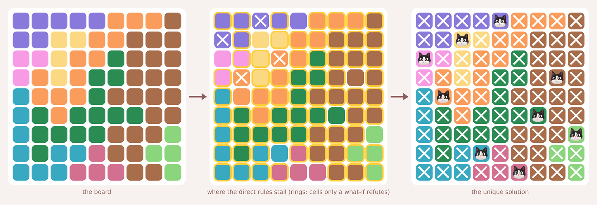

```
000004443
001144333
221446333
241466333
744463333
764666633
766663335
767783355
777888335
```


```
000004444
001144333
221446333
241466333
744463333
764666633
766663335
767783355
777888335
```

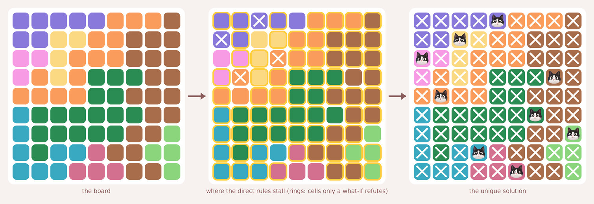

```
000004443
001144333
221444333
241466633
444466333
766666633
766666335
767783355
777888335
```

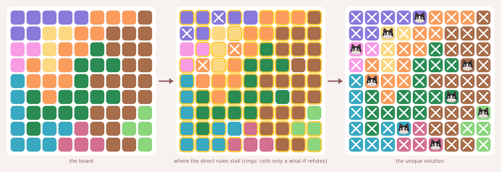

```
000004443
001144333
221446333
241466633
744463333
764666633
766663335
767783355
777888335
```

295 more tying boards are in `hardest.json`.

## 10 x 10: difficulty (1, 1, 42, 19), 564 board(s)

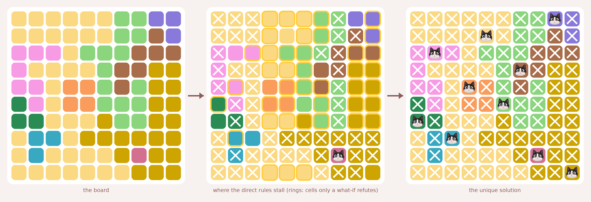

```
1111115500
1111115530
2221555333
2111153399
2214453599
6214455599
6611195599
1771999999
1711119899
1111111999
```

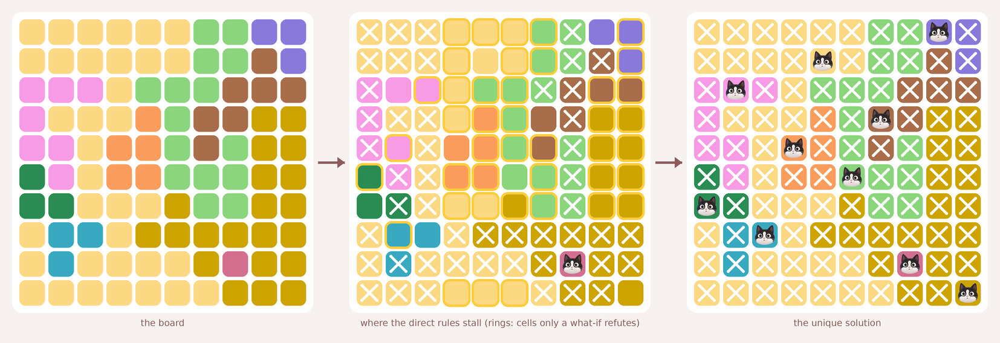

```
1111115500
1111115530
2221555333
2111453399
2214453599
6214455599
6611195599
1771999999
1711119899
1111111999
```

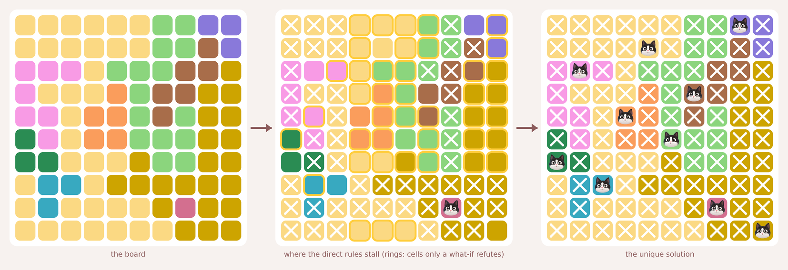

```
1111115500
1111115530
2221555339
2111453399
2214453599
6214455599
6611195599
1771999999
1711119899
1111111999
```


```
1111115500
1111115530
2221555330
2111153399
2214453599
6214455599
6611195599
1771999999
1711119899
1111111999
```

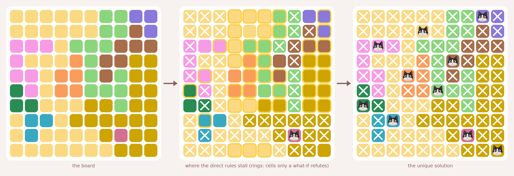

```
1111115500
1111115530
2221555333
2111453399
2214453599
6214455599
6611199599
1771999999
1711119899
1111111999
```


```
1111115500
1111115530
2221555339
2111453399
2214453599
6214455599
6611195599
1771199999
1711119899
1111111999
```

558 more tying boards are in `hardest.json`.

