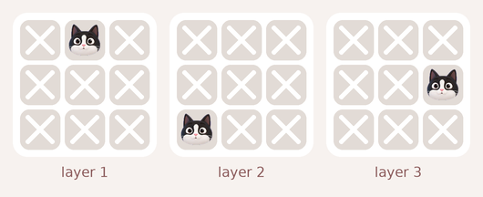
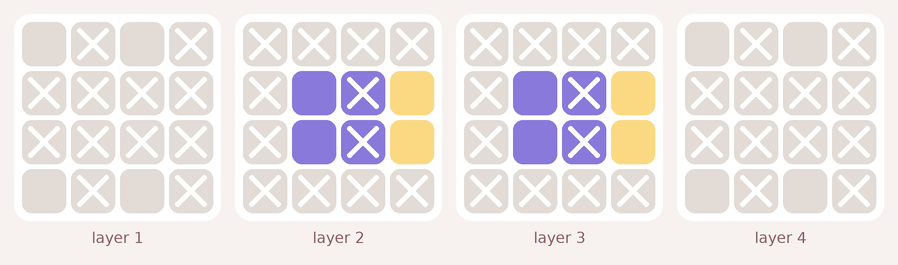
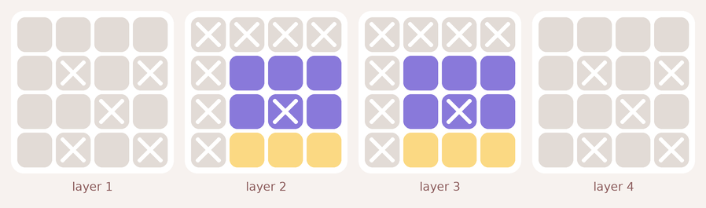
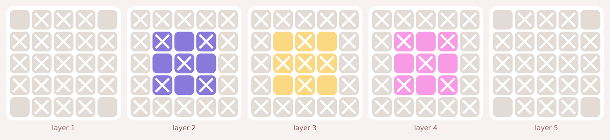
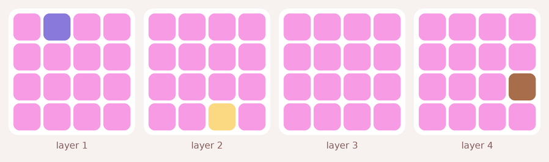
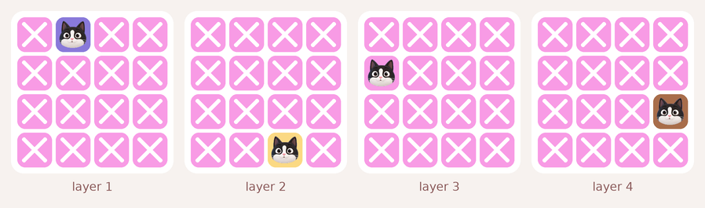
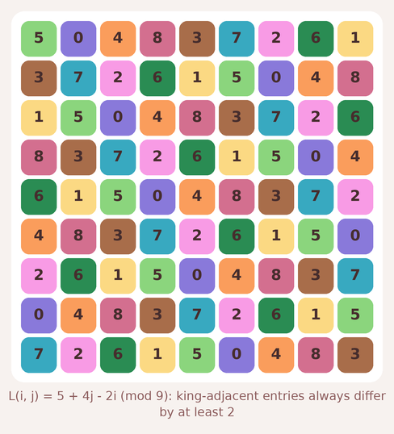

# Meowdoku in three and more dimensions: a report

Everything below was computed by `nd.py` (results in `variants_nd*.json`), except where a proof is given.  Notation: a *d-cube of side n* has n^d cells; a *slice* is an (d−1)-dimensional layer perpendicular to one axis; two cells *touch* when every coordinate differs by at most 1 (the 3^d − 1 neighbourhood).

## 1. Two ways to go up a dimension

In 2D a cat owns a row and a column.  In d dimensions there are two natural readings:

* **Slice variant.**  n cats in the n^d cube, exactly one per slice in every direction, n colours with one cat each, no two cats touching.  A placement is a list of cats (i, p₁(i), …, p_{d−1}(i)) with each pᵢ a permutation.  This is the reading in which every 2D theorem has a direct analogue.
* **Line variant.**  One cat on every axis-parallel line, so n^{d−1} cats, n^{d−1} colours, no two cats touching.  Writing the height of the cat above the cell x of the base as L(x), the line rules say that L is a *Latin (d−1)-cube* and the touching rule says that king-adjacent entries of L differ by at least 2.

The 2D counting rules (Rules 8-10) need only that rows, columns and colours are *separating*: two cats that share one are the same cat.  Slices and colours are separating in every dimension and for both variants, so the Lean lemmas `hall1`, `hall2`, `hall3` and common attack (Rule 1) transfer without change.  What does *not* transfer is anything that used the geometry of the knight's move.

## 2. The slice variant

### 2.1 The knight's move in d dimensions

Two cats in consecutive slices of one axis must differ by at least 2 in *at least one* of the other d − 1 coordinates (otherwise they touch).  In 2D there is only one other coordinate, so the cats are a knight's move apart.  In 3D the projection onto the transverse plane must move at Chebyshev distance ≥ 2: a knight's move in one coordinate is enough, the other may stay put.  This single difference explains every change below.

### 2.2 Capacities: the 3 × 3 anomaly disappears, the 2^d anomaly stays

**d = 3** (region-free maximum number of cats in a box):

| box | 1x1x1 | 1x1x2 | 1x1x3 | 1x1x4 | 1x2x2 | 1x2x3 | 1x2x4 | 1x3x3 | 1x3x4 | 1x4x4 | 2x2x2 | 2x2x3 | 2x2x4 | 2x3x3 | 2x3x4 | 2x4x4 | 3x3x3 | 3x3x4 | 3x4x4 | 4x4x4 |
|---|---|---|---|---|---|---|---|---|---|---|---|---|---|---|---|---|---|---|---|---|
| cats | 1 | 1 | 1 | 1 | 1 | 1 | 1 | 1 | 1 | 1 | 1 | 2 | 2 | 2 | 2 | 2 | 3 | 3 | 3 | 4 |

Boxes holding fewer than their smallest side: 2x2x2.

**d = 4** (region-free maximum number of cats in a box):

| box | 1x1x1x1 | 1x1x1x2 | 1x1x1x3 | 1x1x2x2 | 1x1x2x3 | 1x1x3x3 | 1x2x2x2 | 1x2x2x3 | 1x2x3x3 | 1x3x3x3 | 2x2x2x2 | 2x2x2x3 | 2x2x3x3 | 2x3x3x3 | 3x3x3x3 |
|---|---|---|---|---|---|---|---|---|---|---|---|---|---|---|---|
| cats | 1 | 1 | 1 | 1 | 1 | 1 | 1 | 1 | 1 | 1 | 1 | 2 | 2 | 2 | 3 |

Boxes holding fewer than their smallest side: 2x2x2x2.

**d = 5** (region-free maximum number of cats in a box):

| box | 1x1x1x1x1 | 1x1x1x1x2 | 1x1x1x1x3 | 1x1x1x2x2 | 1x1x1x2x3 | 1x1x1x3x3 | 1x1x2x2x2 | 1x1x2x2x3 | 1x1x2x3x3 | 1x2x2x2x2 | 1x2x2x2x3 | 1x2x2x3x3 | 2x2x2x2x2 | 2x2x2x2x3 | 2x2x2x3x3 |
|---|---|---|---|---|---|---|---|---|---|---|---|---|---|---|---|
| cats | 1 | 1 | 1 | 1 | 1 | 1 | 1 | 1 | 1 | 1 | 1 | 1 | 1 | 2 | 2 |

Boxes holding fewer than their smallest side: 2x2x2x2x2.

**Theorem (2^d rule).**  A 2 × 2 × … × 2 box holds at most one cat in every dimension: any two of its cells differ by at most 1 in every coordinate, so they touch.

**Observation (verified for all boxes with sides ≤ 4 in 3D and ≤ 3 in 4D and 5D).**  Every other box holds min(side) cats.  In particular the 3 × 3 × 3 holds three cats, for example (0,0,1), (1,2,0), (2,1,2): consecutive layers use a knight's move in one transverse coordinate and a step of 0 or 2 in the other.  The 2D proof of the 3 × 3 rule fails exactly because it has no second transverse coordinate to spend.  Consequence: *the impossible layouts of 2D are not impossible in 3D*, except for the all-2 box.  Three colours confined to a 3 × 3 × 3 is a legal position.

### 2.3 How many placements

| dimension \ n | 1 | 2 | 3 | 4 | 5 | 6 | 7 | 8 |
|---|---|---|---|---|---|---|---|---|
| d = 2 | 1 | 0 | 0 | 2 | 14 | 90 | 646 | 5242 |
| d = 3 | 1 | 0 | 8 | 236 | 7188 | 288940 | 15296980 |  |
| d = 4 | 1 | 0 | 96 | 9272 | 1331144 |  |  |  |
| d = 5 | 1 | 0 | 800 | 274160 |  |  |  |  |

d = 2 is Hertzsprung's sequence (OEIS A002464).  The d = 3 sequence 1, 0, 8, 236, 7188, 288940, 15296980 is not in the OEIS (searched 2026-09-13).  Some structure is visible: n = 2 is 0 in every dimension (the 2^d rule), n = 3 gives 0, 8, 800 for d = 2, 3, 5 (in 3D: the cat of the middle layer sits on one of 8 edge-midpoints or corners with the other two forced), and for fixed n the count grows roughly like (n!)^{d−1} times a constant that tends to 1 as d grows, because a random pair of consecutive cats touches with probability about (3/n)^{d−1}.

### 2.4 Forced patterns inside small boxes

As in 2D, if k = cap(box) colours are confined to a box, the k cats sit inside it and some cells of the box (and around it) are provably empty in every solution.  Computed region-free on a 6 × 6 × 6 board:

| box | k = cap | forced empty inside | forced empty adjacent | slices whose cat is inside the box |
|---|---|---|---|---|
| 1x1x1 | 1 | 0 | 26 | axis 0: layers [0]; axis 1: layers [0]; axis 2: layers [0] |
| 1x1x2 | 1 | 0 | 26 | axis 0: layers [0]; axis 1: layers [0] |
| 1x1x3 | 1 | 0 | 26 | axis 0: layers [0]; axis 1: layers [0] |
| 1x2x2 | 1 | 0 | 20 | axis 0: layers [0] |
| 1x2x3 | 1 | 0 | 18 | axis 0: layers [0] |
| 1x3x3 | 1 | 0 | 18 | axis 0: layers [0] |
| 2x2x2 | 1 | 0 | 0 | none |
| 2x2x3 | 2 | 4 | 56 | axis 0: layers [0, 1]; axis 1: layers [0, 1]; axis 2: layers [0, 2] |
| 2x3x3 | 2 | 2 | 42 | axis 0: layers [0, 1] |
| 3x3x3 | 3 | 15 | 90 | axis 0: layers [0, 1, 2]; axis 1: layers [0, 1, 2]; axis 2: layers [0, 1, 2] |

Three of them deserve names:

* **2 × 2 × 3 with two colours** (the 3D Rule 5): the middle layer of the long axis is empty, the two cats are in the end layers, and every slice of the box in the two short directions is used, so those slices are empty outside the box.
* **2 × 3 × 3 with two colours** (the 3D Rule 4): the two central cells (1,1) of both layers are empty.  Unlike 2D, nothing outside the box is forced.
* **3 × 3 × 3 with three colours** (the 3D knight ring): 15 of the 27 cells are empty.  The outer layers keep only their four edge-midpoints, the middle layer keeps only its four corners, and every slice in every direction is used, so the box empties its three layers in all three directions outside itself.

### 2.5 Single colours: nothing beyond common attack

For all 11 polycubes up to size 4 the cells a lone colour forces empty are exactly the cells attacked by every cell of the shape (the intersection rule), verified with Z3 on a 7 × 7 × 7 board (the straight tetracube was re-checked on 9 × 9 × 9 because its window fell off the smaller board).  So, as in 2D, there is no hidden single-colour rule.

### 2.6 Two colours: one what-if is still enough (small shapes)

For every pair of disjoint shapes of size ≤ 2 inside a 3 × 3 × 3 window (157 pairs up to the 48 symmetries of the cube), on a 5 × 5 × 5 board: 99 pairs are impossible, 48 force cells that common attack alone misses, and in 48 of those every missed cell falls to a single what-if (assume the cat, apply common attack for the two colours and the slices, reach an empty unit).  Pairs needing more: 0.

### 2.7 Random boards are easier, not harder

| board | random boards | unique solution | share unique | needing a what-if |
|---|---|---|---|---|
| 3D, n = 3 | 3000 | 1610 | 54% | 0 |
| 3D, n = 4 | 2000 | 528 | 26% | 0 |
| 3D, n = 5 | 300 | 46 | 15% | 0 |
| 4D, n = 3 | 2000 | 439 | 22% | 0 |
| 4D, n = 4 | 150 | 22 | 15% | 0 |

Colours were grown from a random valid placement exactly as in 2D.  Two things stand out.  Random 3D and 4D colourings have a unique solution far more often than 2D ones (2D: 65% at n = 5 falling to 15% at n = 10; 3D: 54% at n = 3, 26% at n = 4, 15% at n = 5), because a colour that touches n − 1 slices in each of three directions is a very tight constraint.  And *none* of the unique random boards needed a what-if: the direct rules finished every one.  A hill-climb on the colouring (`hard3d.py`) looks for boards that do:

## 3. The line variant: king-distance Latin cubes

With one cat per axis-parallel line, the cat above base cell x is at height L(x) and:

* each line of the base holds every height once (L is a Latin square in 3D, a Latin cube in 4D);
* two cats touch iff their base cells are king-adjacent (or equal) and |ΔL| ≤ 1.

So the line variant is solvable exactly when a Latin (d−1)-cube of order n exists whose king-adjacent entries always differ by at least 2.  In 2D (d = 2) this is just a knight permutation.

### 3.1 The cyclic construction

Take L(x) = Σ aᵢ xᵢ (mod n).  It is Latin iff every aᵢ is a unit mod n, and it has the king property iff every signed sum ±aᵢ ± aⱼ ± … over a non-empty subset of the coefficients lies in [2, n − 2] mod n.  Orders admitting such coefficients (checked up to 40):

| variant | smallest cyclic order | orders ≤ 40 with no cyclic solution |
|---|---|---|
| d = 2 (Latin 1-cube) | 5 | 2, 3, 4, 6 |
| d = 3 (Latin 2-cube) | 9 | 2, 3, 4, 5, 6, 7, 8, 10, 12 |
| d = 4 (Latin 3-cube) | 17 | 2, 3, 4, 5, 6, 7, 8, 9, 10, 11, 12, 13, 14, 15, 16, 18, 20, 22, 24, 30 |
| d = 5 (Latin 4-cube) | 33 | 2, 3, 4, 5, 6, 7, 8, 9, 10, 11, 12, 13, 14, 15, 16, 17, 18, 19, 20, 21, 22, 23, 24, 25, 26, 27, 28, 29, 30, 31, 32, 34, 36, 38, 40 |

### 3.2 Existence by exhaustive search

3D (Latin squares), Z3 on the full search space:

| order | 2 | 3 | 4 | 5 | 6 | 7 | 8 | 9 | 10 |
|---|---|---|---|---|---|---|---|---|---|
| exists? | no | no | no | no | no | no | no | yes | no |

So the smallest solvable 3D line-variant cube has side 9, the cyclic square of section 3.1 is a witness, order 10 has none at all (not just none cyclic), and orders 11 and above 12 are covered by the cyclic construction.  Order 12 is the last open case below 40.

4D (Latin cubes with the 26-neighbour king condition), Z3 with a 20-minute cap per order:

| order | 5 | 6 | 7 | 8 | 9 |
|---|---|---|---|---|---|
| result | unsat | unsat | unsat | unsat | unsat |

### 3.3 Capacities in the dense variant

| box | 1x1x1 | 1x1x2 | 1x1x3 | 1x2x2 | 1x2x3 | 1x3x3 | 2x2x2 | 2x2x3 | 2x3x3 | 3x3x3 |
|---|---|---|---|---|---|---|---|---|---|---|
| cats | 1 | 1 | 1 | 1 | 2 | 2 | 1 | 2 | 4 | 5 |

A 3 × 3 × 3 holds five non-touching cats when a cat only owns its three lines.  Because the variant is dense (n² cats in n³ cells, one on every line) these numbers are upper bounds *and* every line inside a box wants a cat, so a box of side s must contain at least s² − (cats that can sit on its lines outside it); the exact lower bounds are an open item.

## 4. Scorecard: what survives in dimension d

| 2D rule | slice variant, d ≥ 3 | line variant |
|---|---|---|
| Rule 1 common attack | yes, verbatim (attack = shares a slice or touches) | yes (attack = shares a line or touches) |
| Rule 2 knight's move | weaker: Chebyshev distance ≥ 2 in the transverse projection | |ΔL| ≥ 2 on king-adjacent base cells |
| 2 × 2 holds one cat | yes: the 2^d box holds one cat | yes (2 × 2 × 2 holds one) |
| 3 × 3 holds two cats | no: 3^d holds three (min side) for d ≥ 3 | 3 × 3 × 3 holds five |
| Rules 5-7 patterns | replaced by the 2 × 2 × 3, 2 × 3 × 3 and 3 × 3 × 3 patterns of 2.4 | open |
| Rules 8-10 counting | yes, verbatim (separating maps) | yes, verbatim |
| single colour = intersection rule | yes (polycubes ≤ 4) | not checked |
| one what-if is complete locally | yes for shapes ≤ 2 in a 3 × 3 × 3 window | not checked |
| random boards need what-ifs | never observed; hill-climb result in 2.7 | n/a |

## 5. Conjectures

1. **cap = min side except the all-2 box**, for the slice variant in every dimension d ≥ 3 and every box.  (Verified: sides ≤ 4 in 3D, ≤ 3 in 4D and 5D.)
2. **The 3D count sequence** 1, 0, 8, 236, 7188, 288940, 15296980 satisfies a linear recurrence with polynomial coefficients, like Hertzsprung's, obtained by inclusion-exclusion over the set of consecutive pairs that touch (a pair touches iff it is a difference of at most 1 in *both* permutations).
3. **King-distance Latin squares exist for every order n ≥ 13 and for 9 and 11, and for no other order** (order 12 pending the search above).  Latin cubes with the 26-neighbour condition exist for every n ≥ 25 and for 17, 19, 21, 23; the smallest order is between 9 and 17.
4. **One what-if is locally complete in 3D** for two colours of any shape inside a 3 × 3 × 3 window, as it is in 2D for shapes up to size 4 inside a 3 × 3 window.
5. **Direct rules are complete for small cubes**: no 3D or 4D colouring with a unique solution and n ≤ 4 needs a what-if.  (Refuted if the hill-climb in 2.7 found a depth-1 board.)

