# Solving the hardest 10 x 10 board by hand

Cells are written r<row>c<column>, counted from 1 at the top left.  Colours are named as in the playable page.  Every step is one rule from RULES.md; the solver logged them in the order a careful player would find them.

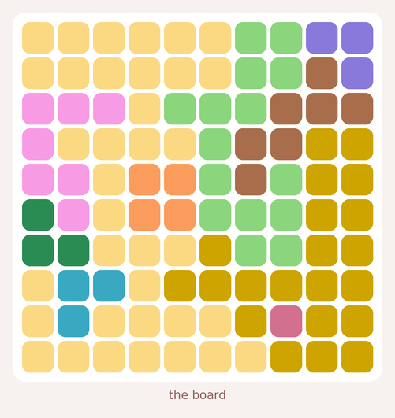

## 1. Cat 1: r9c8

* **Common attack from purple.** Every cell where its cat could still go attacks r2c9, so cross those out.
* **Common attack from pink.** Every cell where its cat could still go attacks r4c2, so cross those out.
* **Common attack from brown.** Every cell where its cat could still go attacks r3c7, so cross those out.
* **Common attack from dark green.** Every cell where its cat could still go attacks r6c2, r8c1, so cross those out.
* **Common attack from blue.** Every cell where its cat could still go attacks r7c2, r9c3, so cross those out.
* **Rose has only one cell left**, so the cat goes on r9c8. Cross out everything it attacks and the rest of its colour (22 cells).

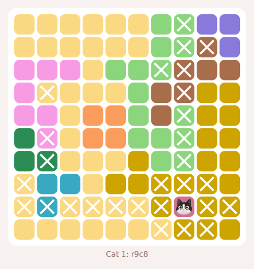

## 2. Direct rules

* **Common attack from dark green.** Every cell where its cat could still go attacks r1c1, r2c1, r3c1, r4c1, r5c1, r10c1, so cross those out.
* **Common attack from blue.** Every cell where its cat could still go attacks r7c3, r8c4, r8c5, r8c6, r8c10, so cross those out.
* **Common attack from pink.** Every cell where its cat could still go attacks r2c2, r4c3, so cross those out.
* **Pink and blue fit inside columns 2 and 3**, so those columns belong to them: cross out r1c2, r1c3, r2c3, r5c3, r6c3, r10c2, r10c3.

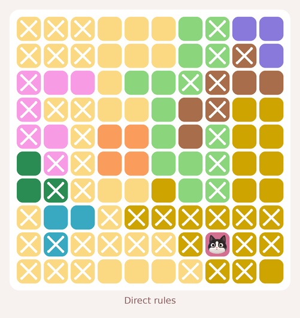

## 3. Stuck: try r6c1

* Suppose a cat sits on **r6c1**. It crosses out its row, column, colour and neighbours.
* **Common attack from pink.** Every cell where its cat could still go attacks r3c4, r3c5, r3c6, r3c9, r3c10, so cross those out.
* **Common attack from brown.** Every cell where its cat could still go attacks r1c7, r2c7, r4c6, r5c6, r7c7, so cross those out.
* **Common attack from orange.** Every cell where its cat could still go attacks r4c4, r4c5, r5c7, r5c9, r5c10, so cross those out.
* **Contradiction: green has no cell left.** So r6c1 cannot hold a cat: cross it out.

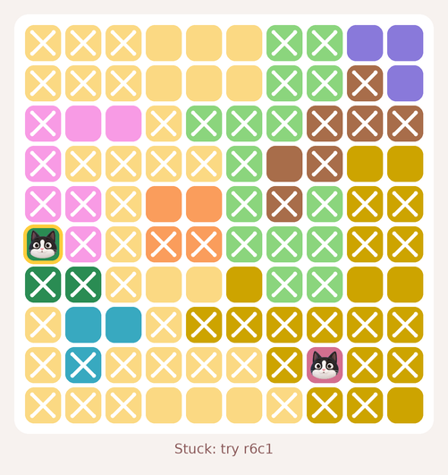

## 4. Cat 2: r7c1

* **Column 1 has only one cell left**, so the cat goes on r7c1. Cross out everything it attacks and the rest of its colour (8 cells).

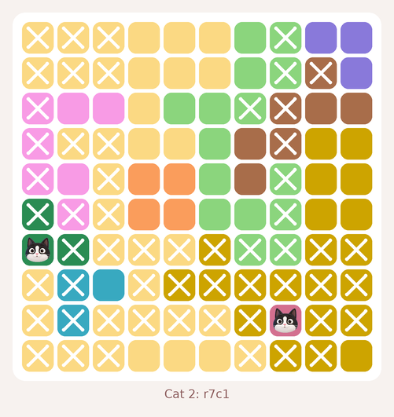

## 5. Cat 3: r8c3

* **Blue has only one cell left**, so the cat goes on r8c3. Cross out everything it attacks and the rest of its colour (2 cells).

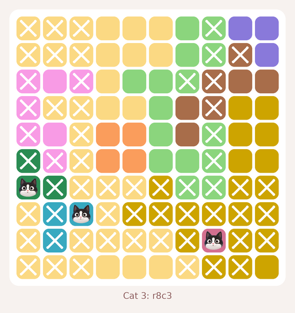

## 6. Cat 4: r4c7

* **Purple and gold fit inside columns 9 and 10**, so those columns belong to them: cross out r3c9, r3c10.
* **Purple and brown and gold fit inside columns 7 and 9 and 10**, so those columns belong to them: cross out r1c7, r2c7, r6c7.
* **Common attack from column 7.** Every cell where its cat could still go attacks r4c6, r5c6, so cross those out.
* **Common attack from green.** Every cell where its cat could still go attacks r2c6, so cross those out.
* **Pink and orange and green fit inside rows 3 and 5 and 6**, so those rows belong to them: cross out r3c4, r5c7, r5c9, r5c10, r6c9, r6c10.
* **Rows 1 and 2 contain only purple and yellow**, so those colours' cats are there: cross out their other cells r4c4, r4c5, r10c4, r10c5, r10c6.
* **Rows 1 and 2 and 10 contain only purple and yellow and gold**, so those colours' cats are there: cross out their other cells r4c9, r4c10.
* **Gold fits inside column 10**, so that column belongs to it: cross out r1c10, r2c10.
* **Common attack from row 2.** Every cell where its cat could still go attacks r1c4, r1c5, r3c5, so cross those out.
* **Row 4 has only one cell left**, so the cat goes on r4c7. Cross out everything it attacks and the rest of its colour (2 cells).

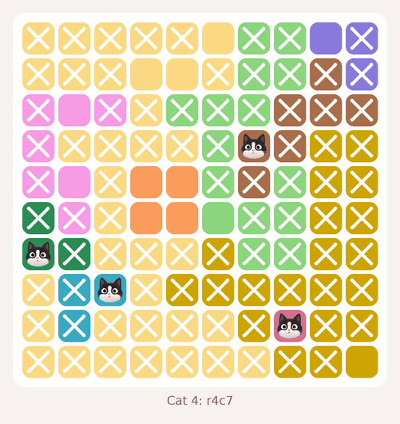

## 7. Cat 5: r10c10

* **Common attack from row 6.** Every cell where its cat could still go attacks r5c5, so cross those out.
* **Row 10 has only one cell left**, so the cat goes on r10c10. Cross out everything it attacks and the rest of its colour (1 cell).

## 8. Cat 6: r1c9

* **Column 9 has only one cell left**, so the cat goes on r1c9. Cross out everything it attacks and the rest of its colour (2 cells).

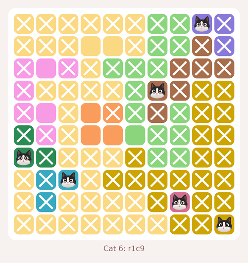

## 9. Cat 7: r6c6

* **Green has only one cell left**, so the cat goes on r6c6. Cross out everything it attacks and the rest of its colour (3 cells).

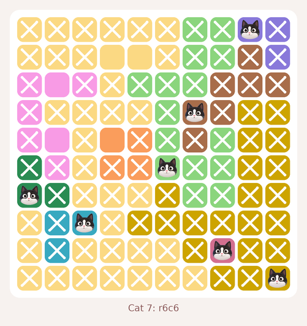

## 10. Cat 8: r3c2

* **Row 3 has only one cell left**, so the cat goes on r3c2. Cross out everything it attacks and the rest of its colour (2 cells).

## 11. Cat 9: r5c4

* **Row 5 has only one cell left**, so the cat goes on r5c4. Cross out everything it attacks and the rest of its colour (2 cells).

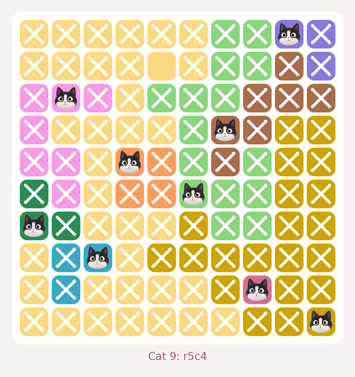

## 12. Cat 10: r2c5

* **Column 5 has only one cell left**, so the cat goes on r2c5. Cross out everything it attacks and the rest of its colour (1 cell).

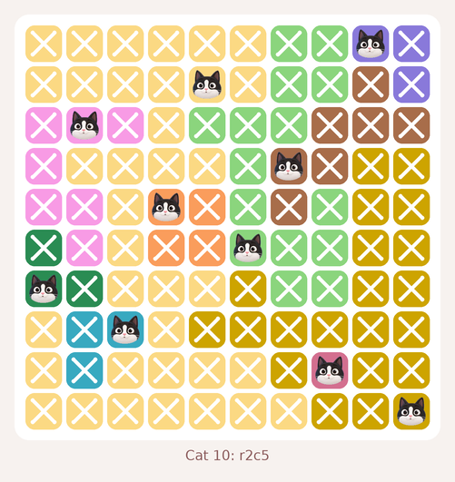

Total: 1 what-if; everything else is direct rules.

